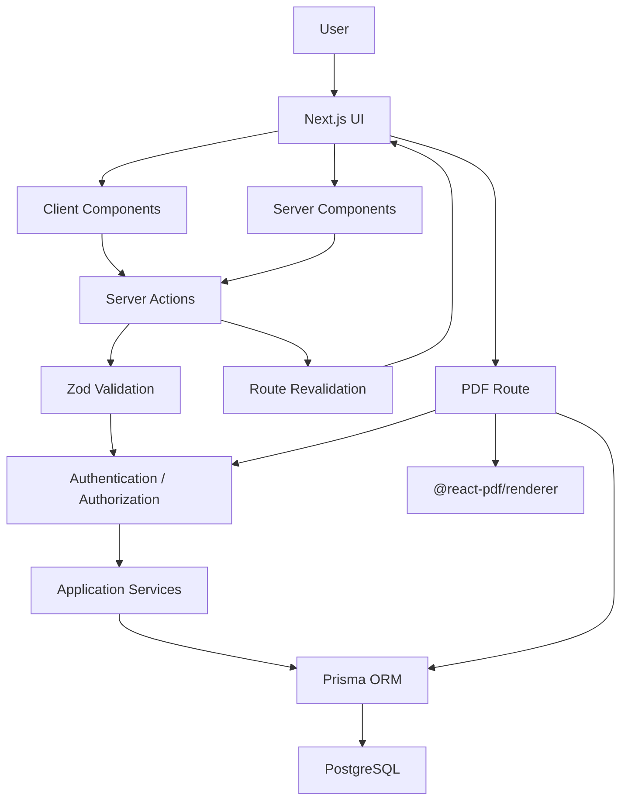
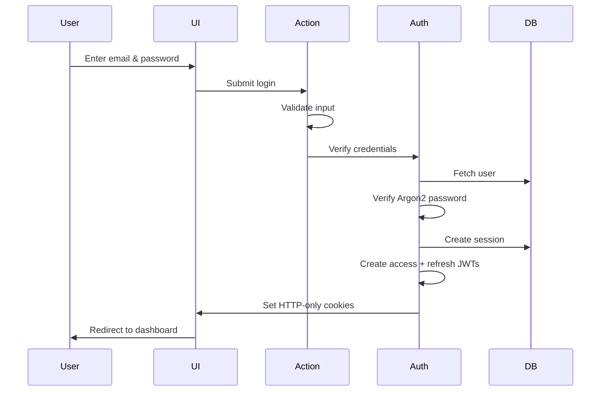
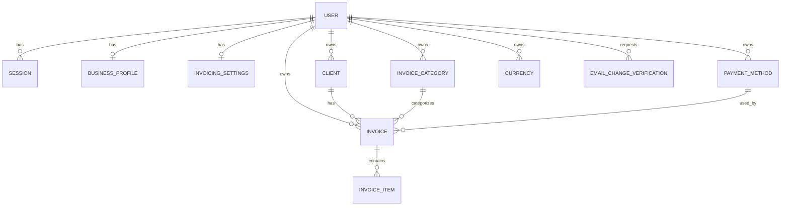
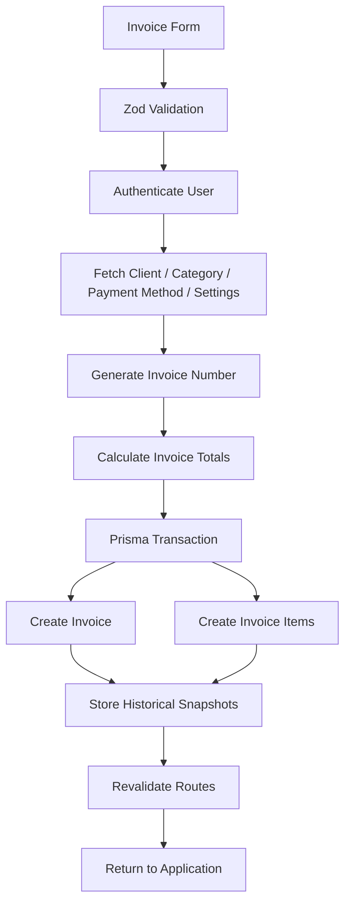

# e-Invoice

**e-Invoice** is a full-stack invoice management application built to handle my own freelance invoicing workflow.

I originally built this application because I needed to send professional invoices to freelance clients. Instead of relying on third-party online invoice generator tools, I decided to build a dedicated application tailored to my own requirements.

The application provides client management, invoice creation and tracking, configurable business and invoicing settings, payment method management, dashboard analytics, and PDF invoice generation.

The project is intentionally designed around an **individual business account** rather than a multi-tenant SaaS model. This keeps the architecture focused on its original use case while still implementing production-oriented patterns such as JWT-based authentication, database-backed sessions, server-side validation, transactional database operations, user-scoped data access, invoice lifecycle management, and historical invoice snapshots.

> **Project status:** Personal/freelance application built and maintained for real-world invoicing use.

---

## Highlights

- Full-stack invoice management application built with Next.js App Router
- Client management with create, view, edit, and delete workflows
- Itemized invoice creation with discounts and automatic total calculations
- Invoice lifecycle management with draft, pending, paid, and cancelled states
- Configurable business profile and invoicing defaults
- Custom invoice categories and currencies
- Multiple payment method types with type-specific validation
- PDF invoice generation using `@react-pdf/renderer`
- Dashboard with invoice, revenue, outstanding, and overdue analytics
- JWT-based authentication with access and refresh tokens
- Database-backed sessions with hashed refresh-token persistence
- Argon2 password hashing
- Email verification for email-change workflows
- Server-side and client-side validation using Zod
- User-scoped database access and ownership checks
- Historical invoice snapshots for client, category, and payment information

---

## Tech Stack

| Technology         | Purpose                                               |
| ------------------ | ----------------------------------------------------- |
| **Next.js 16**     | Full-stack application framework using the App Router |
| **React 19**       | UI development                                        |
| **TypeScript 5**   | Type-safe application development                     |
| **Tailwind CSS 4** | Styling and responsive UI                             |
| **Prisma**         | ORM and database access                               |
| **PostgreSQL**     | Relational database                                   |
| **Zod**            | Client/server validation                              |
| **JWT / JOSE**     | Authentication token creation and verification        |
| **Argon2**         | Password hashing                                      |
| **Nodemailer**     | SMTP-based email delivery                             |
| **React PDF**      | Server-side invoice PDF generation                    |
| **Recharts**       | Dashboard data visualization                          |
| **Sonner**         | Toast notifications                                   |
| **Lucide React**   | Icons                                                 |

---

## Architecture

The application follows a **server-centric Next.js architecture**.

Most application data is fetched through server components, while mutations are handled through server actions. Prisma provides the database access layer, and client components are primarily used where interactivity or local UI state is required.



### Architectural principles

The application primarily follows these patterns:

- **Server Components** for server-side rendering and data fetching
- **Client Components** for interactive forms, dialogs, filters, and UI state
- **Server Actions** for application mutations
- **Zod** for input validation
- **Prisma** for database access
- **User-scoped queries** for data ownership
- **Transactions** for multi-record database operations
- **Route revalidation** after successful mutations
- A dedicated route handler for invoice PDF generation

There is no separate REST API layer for normal application operations. Most mutations are implemented through Next.js server actions.

---

## Project Structure

```text
.
├── app/
│   ├── (authentication)/
│   │   └── login/
│   ├── (dashboard)/
│   │   ├── clients/
│   │   ├── invoices/
│   │   ├── settings/
│   │   └── page.tsx
│   ├── api/
│   │   └── invoice/[slug]/pdf/
│   │       └── route.ts
│   ├── globals.css
│   └── layout.tsx
│
├── actions/
│   ├── authentication/
│   ├── clients/
│   ├── dashboard/
│   ├── invoices/
│   └── settings/
│
├── components/
│   ├── authentication/
│   ├── clients/
│   ├── dashboard/
│   ├── invoices/
│   ├── layout/
│   ├── settings/
│   └── ui/
│
├── lib/
│   ├── authentication/
│   ├── constants/
│   ├── db/
│   ├── validators/
│   ├── env.ts
│   └── utils.ts
│
├── prisma/
│   └── schema.prisma
│
├── services/
│   ├── authentication.service.ts
│   └── email.service.ts
│
├── scripts/
│   └── seed-admin.ts
│
├── public/
├── types/
├── .env.example
├── package.json
├── next.config.ts
├── prisma.config.ts
├── eslint.config.mjs
└── README.md
```

### Directory responsibilities

| Directory     | Responsibility                                                                |
| ------------- | ----------------------------------------------------------------------------- |
| `app/`        | Routes, layouts, pages, and API route handlers                                |
| `actions/`    | Server actions grouped by application feature                                 |
| `components/` | Feature components and reusable UI components                                 |
| `lib/`        | Authentication, validation, database utilities, constants, and shared helpers |
| `prisma/`     | Prisma schema and database model definitions                                  |
| `services/`   | Application-level services such as authentication and email delivery          |
| `scripts/`    | Development/bootstrap scripts                                                 |
| `types/`      | Shared TypeScript types                                                       |
| `public/`     | Static assets                                                                 |

---

## Features

### Authentication

The application implements a JWT-backed authentication system with database-backed sessions.

Features include:

- Existing-user login
- Access and refresh tokens
- HTTP-only authentication cookies
- Argon2 password hashing
- Database-backed session management
- Session expiration
- Logout and session invalidation
- Guest-only login route
- Protected application routes
- Password change
- Email change with verification
- Session revocation after security-sensitive account changes

The application does not currently include a public registration flow. An initial account is created through the bootstrap/seed workflow.

### Client Management

Clients can be managed independently and then associated with invoices.

Supported functionality includes:

- Create client
- View client
- Edit client
- Delete client
- Search clients
- Store contact information
- Store company information
- Store address information
- Store website and notes
- Associate clients with invoices

Client records are scoped to the authenticated user.

### Invoice Management

Invoice management is the core domain of the application.

The invoice workflow supports:

- Creating invoices
- Editing invoices
- Viewing invoices
- Cancelling invoices
- Itemized invoice lines
- Quantity and rate calculations
- Percentage-based discounts
- Automatic subtotal calculation
- Automatic grand-total calculation
- Invoice categories
- Custom currencies
- Payment methods
- Payment references
- Invoice notes and terms
- Project information
- Due dates
- Invoice status tracking
- PDF invoice generation

Supported invoice statuses are:

```text
DRAFT
PENDING
PAID
CANCELLED
```

### Dashboard & Analytics

The dashboard provides an overview of the invoicing activity for the authenticated account.

It includes:

- Total clients
- Invoice status counts
- Revenue totals
- Outstanding invoice totals
- Overdue invoice totals
- Recent invoices
- Six-month revenue visualization
- Currency-specific financial totals

Revenue charting is implemented using Recharts.

### Business Profile

The business profile stores information used when generating invoices.

Supported fields include:

- Business name
- Email
- Phone
- Website
- Address
- City
- State
- Country
- Postal code

The profile is associated with the authenticated user.

### Invoicing Settings

The application supports configurable invoicing defaults including:

- Invoice prefix
- Default currency
- Default payment terms
- Default notes

These settings are used by the invoice creation workflow to provide sensible defaults.

### Invoice Categories

Invoices can be organized using configurable categories.

Categories support:

- Name
- Code
- Description
- Active/inactive state

Category codes are unique per user.

### Currencies

The application supports user-configurable currencies.

Each currency contains:

- Currency code
- Currency name
- Currency symbol

Currencies are scoped to the authenticated user and can be selected while creating invoices.

### Payment Methods

The application supports multiple payment method types:

```text
BANK_TRANSFER
UPI
PAYPAL
WISE
OTHER
```

Each payment type has its own validated detail structure.

#### Bank Transfer

```text
accountHolderName
bankName
accountNumber
ifsc
swift
```

#### UPI

```text
upiId
```

#### PayPal

```text
email
```

#### Wise

```text
email
```

#### Other

```text
instructions
```

Payment methods can be:

- Created
- Edited
- Deleted
- Marked as default

Only one payment method is maintained as the default for the account.

---

## Application Routes

### Authentication

| Route    | Purpose                    | Access     |
| -------- | -------------------------- | ---------- |
| `/login` | Sign in to the application | Guest only |

### Dashboard

| Route | Purpose            |
| ----- | ------------------ |
| `/`   | Dashboard overview |

### Clients

| Route                  | Purpose                |
| ---------------------- | ---------------------- |
| `/clients`             | Client list and search |
| `/clients/new`         | Create a client        |
| `/clients/[slug]`      | View client details    |
| `/clients/[slug]/edit` | Edit client            |

### Invoices

| Route                   | Purpose                             |
| ----------------------- | ----------------------------------- |
| `/invoices`             | Invoice list, search, and filtering |
| `/invoices/new`         | Create invoice                      |
| `/invoices/[slug]`      | View invoice                        |
| `/invoices/[slug]/edit` | Edit invoice                        |

### Settings

| Route                        | Purpose                       |
| ---------------------------- | ----------------------------- |
| `/settings`                  | Settings overview             |
| `/settings/account`          | Account and security settings |
| `/settings/business-profile` | Business information          |
| `/settings/invoicing`        | Invoice defaults              |
| `/settings/payment-methods`  | Payment method management     |

### API Route

| Route                     | Purpose              | Authentication |
| ------------------------- | -------------------- | -------------- |
| `/api/invoice/[slug]/pdf` | Generate invoice PDF | Required       |

---

## Authentication & Session Architecture

Authentication is implemented using JWT access and refresh tokens combined with database-backed sessions.

### Login flow



### Access token

The access token contains:

- User ID as subject
- Session ID
- Short-lived expiration

### Refresh token

The refresh token contains:

- User ID as subject
- Session ID
- Longer expiration

Refresh tokens are stored in the database as hashes rather than raw token values.

### Session model

Sessions contain:

- Session ID
- User ID
- Hashed refresh token
- Expiration time
- Creation/update timestamps

Protected operations verify both the token and the corresponding database session.

### Session invalidation

All active sessions are invalidated after sensitive account changes such as:

- Password changes
- Email changes

This forces the account to authenticate again after security-sensitive modifications.

---

## Email Change Verification

Changing the account email address requires verification.

The workflow includes:

1. User requests an email change.
2. A verification code is generated.
3. The code is sent to the new email address through SMTP.
4. The verification code is stored in hashed form.
5. The user submits the verification code.
6. The code is validated.
7. The email address is updated.
8. Existing sessions are invalidated.

Additional protections include:

- Six-digit verification codes
- Verification-code expiration
- Attempt limits
- Request cooldowns
- Session invalidation after successful email change

---

## Database Architecture

The application uses **PostgreSQL** with **Prisma ORM**.

The database is centered around the authenticated user and uses user-scoped relationships for application data.



### Main models

#### User

Stores account information including:

- ID
- Name
- Email
- Password
- Timestamps

The user is the owner of application-level data.

#### Session

Stores authentication sessions and hashed refresh tokens.

#### BusinessProfile

Stores business identity and contact information used on invoices.

#### InvoicingSettings

Stores invoice defaults such as:

- Prefix
- Default currency
- Payment terms
- Default notes

#### Client

Stores client contact, company, address, website, and notes.

#### Invoice

Stores the central transactional invoice data including:

- Invoice number
- Invoice slug
- User
- Client
- Invoice category
- Payment method
- Status
- Dates
- Currency
- Project information
- Discount information
- Calculated totals
- Notes
- Terms
- Payment reference

#### InvoiceItem

Stores individual invoice line items including:

- Description
- Quantity
- Rate
- Amount
- Sort order

#### PaymentMethod

Stores user-defined payment methods and their type-specific details.

#### InvoiceCategory

Stores user-defined invoice categories.

#### Currency

Stores user-defined currencies.

#### EmailChangeVerification

Stores pending email-change verification requests with hashed verification codes, attempt tracking, and expiration.

---

## Invoice Architecture

Invoice creation is implemented as a transactional server-side workflow.

### Invoice creation flow



### Invoice calculations

The application calculates invoice totals using:

```text
subtotal = sum(quantity × rate)

discountAmount = subtotal × (discountPercentage / 100)

grandTotal = subtotal - discountAmount
```

These calculations are performed server-side as part of the invoice creation and update workflows.

### Invoice number generation

Invoice numbers are generated using a combination of:

- Configured invoice prefix
- Invoice date
- Invoice category code
- Generated hash suffix

The application also generates a unique slug used for invoice routes.

---

## Historical Invoice Snapshots

Invoices preserve snapshot information from related records.

For example, invoice records store values such as:

- Client name
- Client email
- Payment method name
- Invoice category name

This is an intentional data-modeling decision.

Invoices are historical financial records, so changing a client's profile or payment method later should not unexpectedly change information displayed on an existing invoice.

This also allows historical invoices and generated PDFs to remain consistent even if the original related record is later modified or deleted.

---

## Invoice Status Lifecycle

Invoices support four statuses:

```text
DRAFT
   ↓
PENDING
   ↓
PAID

PENDING → CANCELLED
DRAFT   → CANCELLED
```

The implementation prevents modifications to invoices that have already reached terminal states such as `PAID` or `CANCELLED`.

A payment reference is required when marking an invoice as `PAID`.

---

## PDF Invoice Generation

Individual invoices can be exported as PDF documents.

The PDF workflow uses:

- Next.js route handlers
- Server-side authentication
- Prisma invoice queries
- `@react-pdf/renderer`

The PDF route is:

```text
/api/invoice/[slug]/pdf
```

The route:

1. Authenticates the current user.
2. Loads the requested invoice.
3. Verifies that it belongs to the authenticated account.
4. Generates the PDF.
5. Returns it as a PDF response.

The generated document uses the invoice's stored historical snapshot data.

---

## Data Access & Server Actions

The application commonly follows this pattern:

```text
User Interaction
       ↓
Client Component
       ↓
Server Action
       ↓
Zod Validation
       ↓
Authentication / Ownership Check
       ↓
Business Logic
       ↓
Prisma
       ↓
PostgreSQL
       ↓
Route Revalidation
       ↓
Updated UI / Toast Feedback
```

Server actions are organized by feature area:

```text
actions/
├── authentication/
├── clients/
├── dashboard/
├── invoices/
└── settings/
```

Multi-record operations use Prisma transactions where consistency is important.

Examples include:

- Creating an invoice with its invoice items
- Updating an invoice and replacing its invoice items
- Managing default payment methods
- Security-sensitive session changes

---

## Validation Strategy

Validation is implemented at both the client and server boundaries.

### Client-side validation

Client-side validation provides immediate feedback while interacting with forms.

### Server-side validation

Server actions independently validate incoming data using Zod.

This ensures that server-side operations do not rely solely on client-side validation.

Important schemas include:

- `loginSchema`
- `clientSchema`
- `createInvoiceSchema`
- `updateInvoiceSchema`
- `paymentMethodSchema`
- Payment-method-specific detail schemas
- `businessProfileSchema`
- `invoicingSettingsSchema`
- `invoiceCategorySchema`
- `currencySchema`
- Account settings schemas

Structured validation errors are returned to the UI and displayed through field-level errors and toast notifications where appropriate.

---

## Error Handling

The application handles errors across multiple layers.

These include:

- Form validation errors
- Authentication failures
- Authorization/ownership failures
- Database errors
- Missing records
- Invalid invoice states
- Verification-code failures
- Session failures

The UI communicates errors through:

- Inline field errors
- Toast notifications
- Redirects
- Route-level error handling where applicable

---

## UI Architecture

The UI uses reusable components organized under `components/`.

```text
components/
├── authentication/
├── clients/
├── dashboard/
├── invoices/
├── layout/
├── settings/
└── ui/
```

The shared UI layer provides reusable primitives such as:

- Button
- Input
- Select
- Dialog
- Table
- Card
- Textarea
- Label

The application uses:

- Tailwind CSS for styling
- Lucide React for icons
- Sonner for notifications
- Recharts for analytics visualization

Client components are primarily used for interactive functionality such as:

- Forms
- Dialogs
- Filters
- Search
- Local UI state
- Interactive invoice item management

---

## Security Architecture

The application implements several security-focused mechanisms:

- Argon2 password hashing
- JWT-based authentication
- HTTP-only authentication cookies
- Separate access and refresh token secrets
- Database-backed sessions
- Hashed refresh-token storage
- Hashed email verification codes
- Session expiration
- User ownership checks
- Server-side validation
- Verification-code attempt limits
- Verification request cooldowns
- Session revocation after password/email changes

The application does not rely solely on client-side authorization. Server-side actions and data-access operations verify the authenticated user's ownership of protected resources.

---

## Environment Variables

The application uses environment variables for database, authentication, and SMTP configuration.

The current `.env.example` defines:

```env
DATABASE_URL=your_database_url_here

NODE_ENV=development/production

JWT_ACCESS_SECRET=your_jwt_access_secret_here
JWT_REFRESH_SECRET=your_jwt_refresh_secret_here

ACCESS_TOKEN_EXPIRY=15m
REFRESH_TOKEN_EXPIRY=30d

SMTP_HOST="smtp.gmail.com"
SMTP_PORT=465
SMTP_USER=smtp_user_email_here
SMTP_PASSWORD="smtp_user_password_here"
EMAIL_FROM=email_from_here
```

Environment variables are validated through `lib/env.ts` using Zod.

> Never commit actual secrets or production credentials to the repository.

---

## Local Development

### Prerequisites

Before running the application locally, make sure you have:

- Node.js
- npm
- PostgreSQL
- SMTP credentials if email functionality is required

### Installation

Clone the repository and install dependencies:

```bash
npm install
```

Configure the required environment variables using `.env.local`.

Generate the Prisma client:

```bash
npm run db:generate
```

Apply database migrations:

```bash
npm run db:migrate
```

For a production database, migrations can be deployed using:

```bash
npm run db:migrate-deploy
```

Start the development server:

```bash
npm run dev
```

---

## Available Scripts

| Command                     | Purpose                                              |
| --------------------------- | ---------------------------------------------------- |
| `npm run dev`               | Start the Next.js development server                 |
| `npm run build`             | Build the application for production                 |
| `npm run start`             | Start the production server                          |
| `npm run lint`              | Run ESLint                                           |
| `npm run seed:admin`        | Bootstrap an initial user account                    |
| `npm run db:generate`       | Generate the Prisma client                           |
| `npm run db:migrate`        | Create/apply development database migrations         |
| `npm run db:migrate-deploy` | Apply existing migrations in deployment environments |

The `seed:admin` script is intended as a bootstrap utility for the initial account rather than a public registration system.

---

## Architecture Scope

The current architecture is intentionally focused on an individual business account because the application was originally built to solve a personal/freelance invoicing requirement.

Application data is consistently scoped through the authenticated user's `userId`, which provides clear ownership boundaries between account data.

The project does not currently implement:

- Public user registration
- Multi-user teams
- Role-based access control
- Organization/workspace management
- Multi-tenant billing
- Forgot-password workflow

These are outside the scope of the current application rather than requirements of the original use case.

The existing user-scoped architecture provides a foundation for introducing multi-user or multi-tenant functionality in the future if the product scope expands.

---

## Engineering Decisions

Several implementation decisions were made specifically around the nature of invoicing as a financial record system.

### Server-side business logic

Invoice calculations, ownership checks, validation, and state transitions are handled server-side rather than trusting the client.

### Transactional invoice creation

Invoice creation and invoice-item creation are performed within a database transaction to avoid partially persisted invoices.

### Historical snapshots

Important client, payment-method, and category information is copied onto invoices so historical records remain stable.

### User-scoped data access

Application data is consistently associated with the authenticated user, providing clear ownership boundaries.

### Session invalidation

Password and email changes invalidate existing sessions to reduce the risk of previously issued sessions remaining active after sensitive account changes.

### Type-specific payment validation

Payment method details are validated according to their selected payment method type instead of accepting an unrestricted JSON structure.

---

## Project Origin

This project started from a practical freelance requirement rather than as a tutorial or purely academic exercise.

I needed to send invoices to freelance clients and initially considered using an existing online invoice generator. Instead, I decided to build my own application so that I could control the invoice structure, client information, payment methods, business defaults, PDF generation, and overall workflow.

The project then evolved into a complete full-stack application with authentication, database persistence, validation, analytics, configurable settings, and a structured invoice lifecycle.

This made the project useful not only as an invoicing tool but also as a practical exercise in designing and implementing a production-oriented full-stack application.

---

## Future Scope

The current application is intentionally focused on the original individual-account use case.

Potential future extensions could include:

- Public user registration
- Password recovery
- Multi-user organizations
- Role-based access control
- Multi-tenant workspaces
- Recurring invoices
- Automated invoice reminders
- Email invoice delivery
- Payment gateway integration
- Invoice templates
- Additional reporting and analytics
- Cloud deployment and production observability

These features are not currently part of the implemented application.

---

## Summary

**e-Invoice** is a full-stack invoice management application built from a real freelance requirement.

The application combines:

- Next.js App Router
- React and TypeScript
- PostgreSQL
- Prisma ORM
- JWT authentication
- Argon2 password hashing
- Zod validation
- Server actions
- Transactional database operations
- PDF invoice generation
- Dashboard analytics
- Configurable business and invoicing settings

The project demonstrates end-to-end full-stack development, from authentication and database design to business logic, validation, UI architecture, analytics, and document generation.

Rather than being designed as a generic multi-tenant SaaS product, the application is intentionally scoped around an individual business account and the practical requirements that motivated its development.
